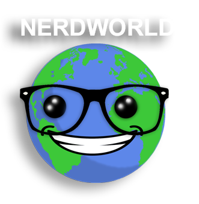

# NerdWorld

 
Nós criamos esse site pensando em produtos geek, assim as pessoas poderiam entrar e comprar esses produtos, você ira encontrar diversos temas tanto de animes, jogos e tambem funkos.

 
 

 
  

 
 
Somos o grupo "Saitama", estamos no nosso quarto semestre e desenvolvemos esse site para o PI (Projeto Integrador) do Centro Universitário SENAC.

 
 
 ## Integrantes
- Pedro Uemura
- Vinicius Cassemiro
- Christian Dambock
- Guilherme Borges
- Caio Barbieri

## Programamos usando:

### Linguagens
---
    

### DB
---

### FRAMEWORKS
---
   
 
 
### IDES
 ---
  
 
 
